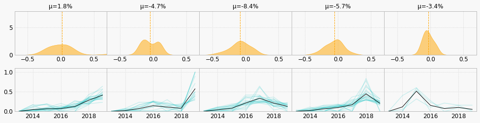
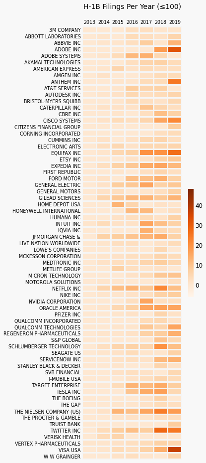

# Analysis of Company H-1B Filings and Stock Returns

```data scraping``` ```record linkage``` ```unsupervised learning``` ```time-series clustering``` ```feature representation``` 

#### Overview

This projects analyzes the H-1B filings for data science and analytics jobs for S&P 500 companies. After combining disparate data sets from h1bdata.info, IEX API, and Yahoo Finance API, the time-series of H-1B filings are transformed and clustered. The project ends with a brief discussion of the clusters and the stock returns within each cluster. 

#### Content
- analysis/main.ipynb - main notebook with data processing, algorithms, and visualizations
- analysis/tools/string.py - contains string similarity metrics and company name standardizer
- analysis/tools/data.py - data scraper and API callers

#### Highlights
- Bespoke record linkage algorithm - used sophisticated algorithm that is tailored for company names
- Dimensionality reduction - used polynomial regression coefficients to represent time series
- Time-series clustering - clustered time series using regression coefficients as additional features

#### Visualization Gallery

- *Stock returns histogram and H-1B filings per year for each company cluster*

<p align="center">

</p>


- *Annual H-1B filings for companies with at most 100 filings*

<p align="center">

</p>


